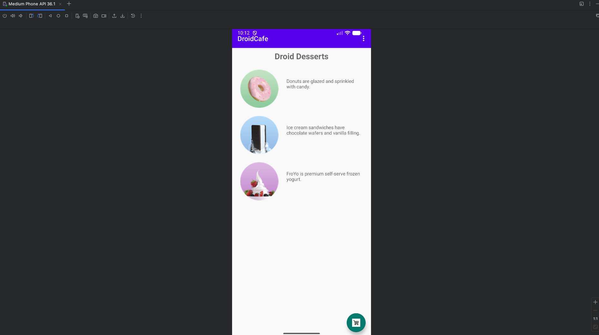
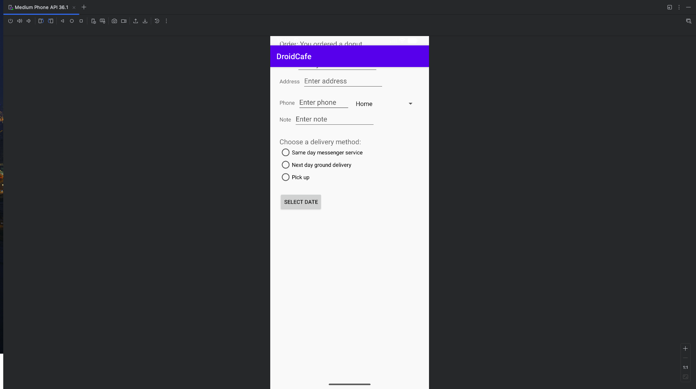
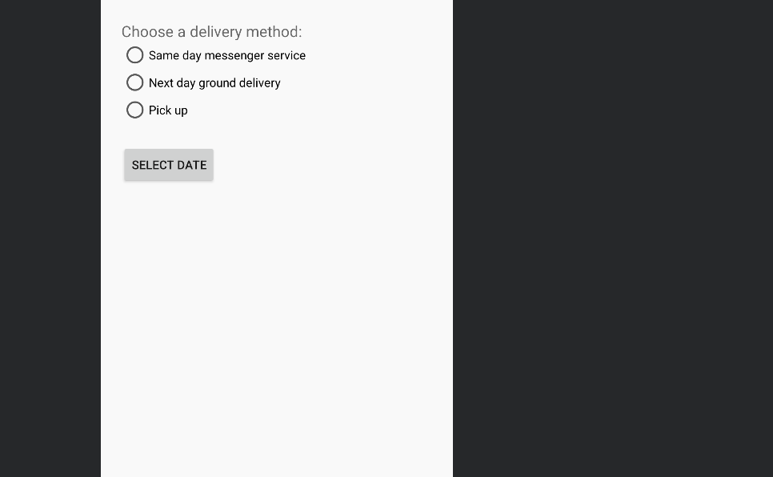
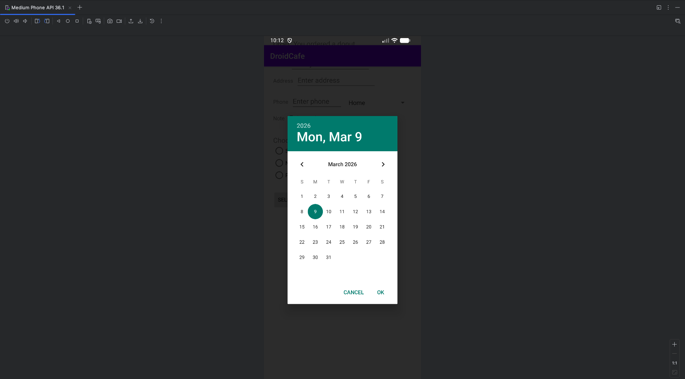

# DroidCafe

An Android ordering app (Java) for a dessert café. Tap a dessert to choose it, then open the order screen to enter delivery details.

## Features

- Main menu with donut, ice cream sandwich and FroYo images; tapping one shows a confirmation toast
- Floating cart button opens the order screen with the chosen dessert
- Order form with name, address, phone and note fields
- Phone-type spinner (Home, Work, Mobile, Other)
- Delivery options as radio buttons (same-day messenger, next-day ground, pick up)
- Date picker for the delivery date

## Running it

Open the folder in Android Studio and run the `app` configuration on an emulator or device (Android 6.0+).

## Screenshots

| Main screen | Order screen | Delivery options | Date picker |
|---|---|---|---|
|  |  |  |  |

The enhancement write-up is in `docs/`.
